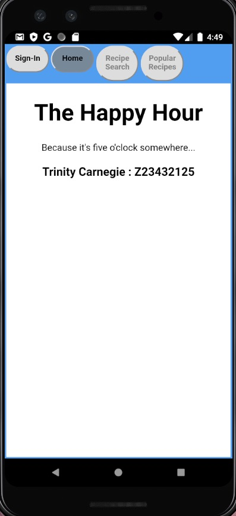

# TheHappyHourApp
  **Final Project for COP4655 Mobile Apps Project** 
  A Cocktail Recipe App
# Home Screen 
  
# How to Use...
    Here are the steps for using this project on an Android Device/Emulator
      1. Click the Sign-In button and sign in with a google account.
          - Note: only signed in users can search for cocktails
      2. To search for recipes click on the "Recipe Search" button and enter an alcohol type into the search bar (ie: Rum, Tequila, etc).
          - A list of up to siz recipes will then be displayed using the type of alcohol enetered.
      3. Now you can create these delicious drinks!
